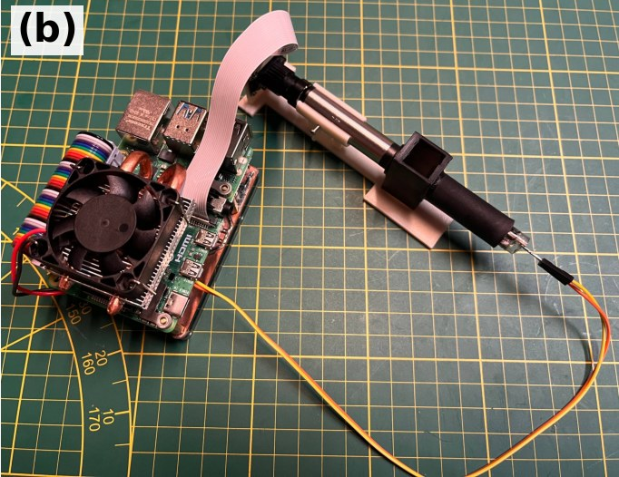

# System B – Raspberry Pi imaging spectrometer (PySpectrometer2 fork)

Acquisition and processing software for **System B** of the article

> A. M. Rivera-Rivera, D. Martinez-Ortiz, F. Quitin, D. Terwagne, S. C. Nicolis, E. Altshuler, A. Campo,
> *Low-Cost Spectrophotometers: A Comparative Evaluation of Open-Source Architectures* (2026), arXiv:XXXX.XXXXX.

System B is a continuous-spectrum imaging spectrophotometer: a Paton Hawksley pocket spectroscope
(transmission diffraction grating) disperses the light transmitted through a 10 mm cuvette, a
Raspberry Pi camera fitted with a 12 mm M12 lens images the spectrum, and a Raspberry Pi 4B extracts
it with [PySpectrometer2](https://github.com/leswright1977/PySpectrometer2) by **Les Wright**.
A 10 W halogen lamp is used as the light source.



*System B: Raspberry Pi camera coupled to a Paton Hawksley pocket spectroscope on a 3D-printed
structure, controlled by a Raspberry Pi 4B (Fig. 1b of the article).*

---

## Relation to the original PySpectrometer2

This repository is a fork of PySpectrometer2 © 2022 Les Wright, distributed under the Apache License 2.0
(see [`LICENCE`](LICENCE) and [`NOTICE`](NOTICE)). The original documentation – key bindings, camera
focusing, USB-camera version – is kept in [`docs/ORIGINAL_README.md`](docs/ORIGINAL_README.md).

What this fork changes with respect to the original:

| | Original PySpectrometer2 | This fork |
|---|---|---|
| Acquisition software (`src/PySpectrometer2-*.py`, `src/specFunctions.py`) | – | **Unmodified** |
| Optical head | Pocket or benchtop spectroscope, M12 zoom or 12 mm lens | Paton Hawksley **pocket** spectroscope + **12 mm** M12 lens, in a 3D-printed mount (`hardware/`) |
| Light source / sample | Emission sources (lamps, lasers) | 10 W halogen lamp through a 10 mm cuvette (absorbance) |
| Absorbance | Not provided | `src/absorbance.py`: absorbance spectrum from a reference and a sample CSV |
| Wavelength calibration | ≥ 3 lines, polynomial fit | 4 mercury lines (404.7, 435.8, 546.1, 577.0 nm), 3rd-order fit |

---

## Repository layout

```
src/        PySpectrometer2 (unmodified) + absorbance.py (added)
hardware/   3D-printable mount and cuvette holder
docs/       Original PySpectrometer2 README
media/      Pictures
```

---

## Bill of materials

Costs as reported in Table IV of the article (EUR, approximate).

| Component | Description | Cost (€) |
|-----------|-------------|---------:|
| Camera | Raspberry Pi camera with M12 lens mount | 15.00 |
| Single-board computer | Raspberry Pi 4 Model B | 65.00 |
| Lens | 12 mm focal length M12 lens | 15.00 |
| Diffraction grating | [Paton Hawksley Pocket Spectroscope](https://www.patonhawksley.com/product-page/pocket-spectroscope) | 100.00 |
| 3D-printed enclosure + accessories | Spectroscope/lens/camera mount ([`hardware/`](hardware/)) | 10.00 |
| Wiring, PCB, power supply | Pi power supply, camera ribbon cable, wiring | 10.00 |
| | **Total** | **215.00** |

Not included in the total (as in the article): 10 W halogen lamp, 10 mm optical cuvettes, a microSD
card, and a monitor/keyboard (or remote desktop) for the Pi.

---

## Assembly

1. Screw the 12 mm M12 lens onto the camera and connect the camera to the Pi's CSI port.
2. Mount the pocket spectroscope in front of the lens in the 3D-printed holder (`hardware/`), with the
   spectroscope slit facing the cuvette and the halogen lamp behind the cuvette, all on one axis.
3. Start the software (below), point the set-up at a bright source and adjust the lens focus until the
   spectrum is sharp; align the camera so the spectrum is horizontal and centred.
4. Fix all parts rigidly: the wavelength calibration is only valid as long as nothing moves.
5. Measure in darkness.

---

## Installation (Raspberry Pi 4B)

Raspberry Pi OS **Bullseye or later** with the libcamera stack (`picamera2`); the legacy camera
stack is not supported.

```bash
sudo apt update
sudo apt install -y python3-opencv python3-picamera2 python3-numpy git
git clone https://gitlab.com/fablab-ulb/projects/cuban-water-lab/pyspectrometer2.git
cd pyspectrometer2/src
python3 PySpectrometer2-Picam2-v1.0.py            # add --waterfall or --fullscreen if desired
```

`absorbance.py` only needs Python 3 and NumPy and can also be run on any other computer.

---

## Usage

### 1. Wavelength calibration (once per assembly)

1. Point the spectrometer at a fluorescent (mercury) lamp.
2. Press `h` (peak hold), then `p` and click the peaks at **404.7, 435.8, 546.1 and 577.0 nm**, from left to right.
3. Press `c` and type the wavelength of each selected pixel in the terminal. With four points the
   software fits a 3rd-order polynomial and prints R²; the result is stored in `caldata.txt` and reloaded
   at every start.

Full details and screenshots: [`docs/ORIGINAL_README.md`](docs/ORIGINAL_README.md#calibration).

### 2. Acquisition

1. Switch on the halogen lamp and let it stabilise.
2. Insert the cuvette with the **blank** (solvent) and press `s`. This saves `Spectrum-<date>--<time>.csv`
   (plus a PNG) in the working directory. Rename it, e.g. `reference.csv`.
3. Replace the blank with the **sample** without moving anything else and press `s` again; rename the
   file, e.g. `sample.csv`.

### 3. Absorbance spectrum

```bash
python3 absorbance.py reference.csv sample.csv -o sample_absorbance.csv
python3 absorbance.py --selftest      # quick check of the computation
```

---

## Data formats

**`Spectrum-*.csv`** (written by PySpectrometer2):

| Column | Unit | Meaning |
|--------|------|---------|
| `Wavelength` | nm | Calibrated wavelength of each of the 800 graph columns |
| `Intensity` | a.u. (0–255) | Intensity averaged over 3 sensor rows |

**Output of `absorbance.py`:**

| Column | Unit | Meaning |
|--------|------|---------|
| `Wavelength_nm` | nm | Reference wavelength grid |
| `I0_Reference` | a.u. | Blank intensity |
| `I_Sample` | a.u. | Sample intensity, interpolated onto the reference grid |
| `Absorbance` | AU | −log₁₀(I / I₀); `nan` where I ≤ 0 or I₀ ≤ 0 |

---

## How to cite

Please cite the article above and the original PySpectrometer2 by Les Wright. Citation metadata is in
[`CITATION.cff`](CITATION.cff).

## Licence

Apache License 2.0 – see [`LICENCE`](LICENCE) and [`NOTICE`](NOTICE). Original work © 2022 Les Wright.

## Acknowledgements

We thank **Les Wright** for PySpectrometer2. This work was carried out within the project *“In situ
monitoring of water quality in Cuban bays: creating and promoting the use of a scientific toolbox”*,
supported by ARES with funding from the Belgian Development Cooperation, at the Innovation Laboratory
(CUJAE, Havana) and Fab Lab ULB (Université libre de Bruxelles). A. C. and S. C. N. acknowledge funding
from the European Union's Horizon Europe research and innovation programme under grant agreement
No. 101181363 (BioDiMoBot). We thank Axel Cornu for valuable advice.
